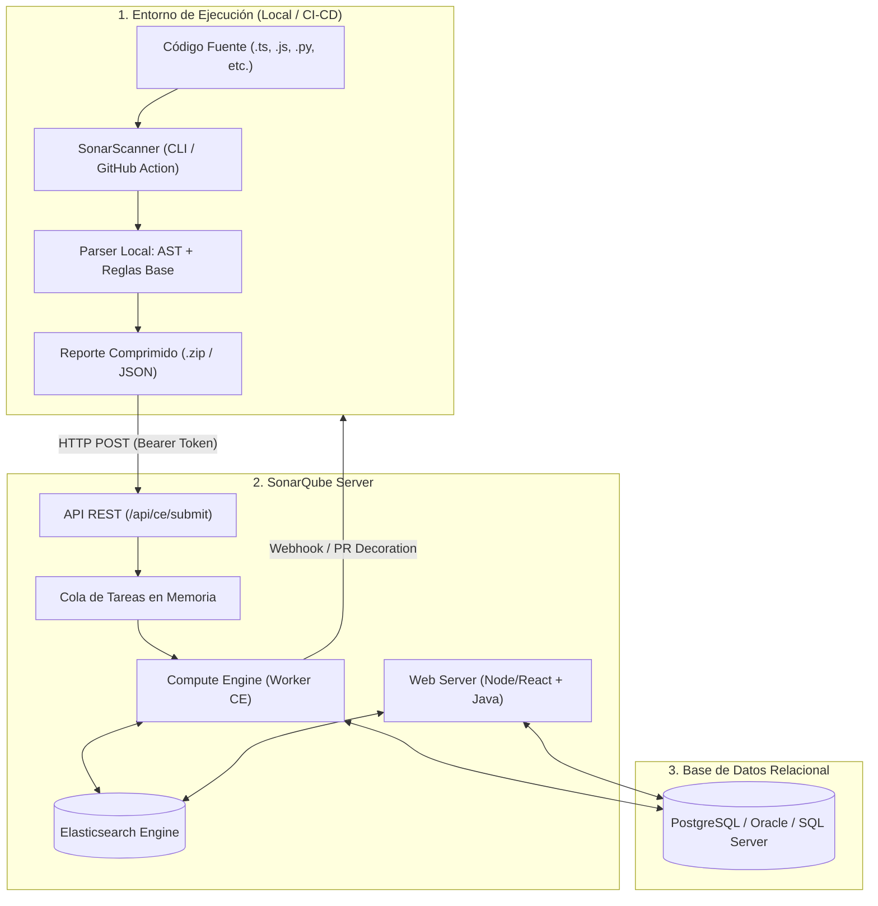
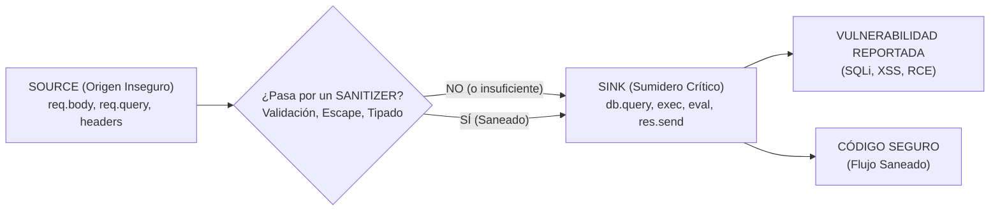
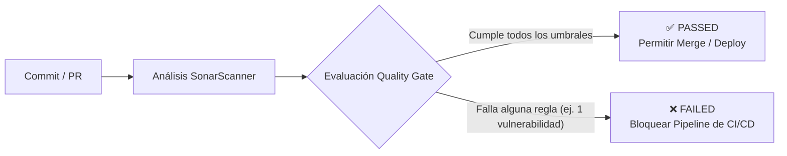

# SonarQube: Fundamentos SAST, Arquitectura Interna, Flujo de Negocio y Ejemplos Prácticos

> **Contexto:** Guía técnica detallada sobre cómo opera SonarQube a nivel interno, su rol como analizador SAST, la lógica de negocio de sus motores de análisis (*Clean as You Code*, SQALE, Quality Gates) y ejemplos reales de código vulnerable vs. corregido.  
> **Ubicación:** `Seguridad_de_Sistemas/herramientas/SonarQube/`  
> **Documentos complementarios:**
> * [quality-gate-y-clean-as-you-code.md](./quality-gate-y-clean-as-you-code.md) (Gobernanza, Quality Gates, CaYC y ciclo de vida de actualizaciones)
> * [sonarqube-cloud.md](./sonarqube-cloud.md) (Configuración práctica y límites en SonarQube Cloud)

---

## 1. SAST vs. DAST: Fundamentos Teóricos y Comparativa

En el ciclo de vida de desarrollo de software seguro (**DevSecOps**), SonarQube se posiciona exclusivamente como una herramienta de **SAST** (*Static Application Security Testing*). Comprender la frontera entre SAST y DAST es fundamental para no generar una falsa sensación de seguridad.

### 1.1. Tabla Comparativa Técnica

| Dimensión | **SAST (SonarQube)** | **DAST (ej. OWASP ZAP, Burp Suite)** |
|---|---|---|
| **Punto de vista** | **Caja Blanca** (*White-Box*): Acceso total al código fuente, scripts de construcción y configuración. | **Caja Negra / Gris** (*Black-Box*): Sin acceso al código; evalúa la aplicación montada desde el exterior. |
| **Momento de ejecución** | **Temprano (Shift-Left)**: En local (IDE) o en CI durante el commit/PR antes de desplegar. | **Tardío**: En entornos de *staging*, pruebas dinámicas o producción con la app corriendo. |
| **Requisitos** | Solo el código fuente y analizadores de sintaxis/compilador. | Servidor web, base de datos levantada, red, credenciales activas y datos de prueba. |
| **Visibilidad del fallo** | Señala el **archivo y número de línea exacto**, con el trazado del flujo de variables. | Muestra la **petición HTTP y respuesta** (cabeceras, payloads, código de estado HTTP). |
| **Qué detecta con precisión** | Inyecciones SQL/XSS en código propio, criptografía rota, secretos hardcodeados, bugs lógicos, code smells. | Fallos de autenticación en sesión, cabeceras HTTP inseguras, cookies mal configuradas, problemas de CORS en vivo, vulnerabilidades de infraestructura/servidor. |
| **Punto débil** | No ve problemas que surgen en tiempo de ejecución (fallos de red, puertos abiertos, bugs de librerías en memoria). | No sabe qué línea de código causó el fallo ni puede evaluar rutas de código que no sean accesibles vía web. |

```
CICLO DEVSECOPS:
[ Código ]  ──( SAST: SonarQube )──> [ Build ] ──> [ Despliegue Staging ] ──( DAST: OWASP ZAP )──> [ Producción ]
```

> [!IMPORTANT]
> **SonarQube NO es DAST:** No realiza peticiones HTTP a servidores en ejecución, no inyecta payloads contra formularios activos ni audita la infraestructura de red. Su alcance es el análisis sintáctico y semántico del código en reposo.

---

## 2. Arquitectura Interna y Componentes de SonarQube

SonarQube no es un binario monolítico; su funcionamiento se divide en tres componentes desacoplados que cooperan para procesar y almacenar los análisis.



### 2.1. Desglose de Componentes

1. **SonarScanner (Cliente / Agente de Análisis):**
   * Se ejecuta en la máquina del desarrollador o en el runner de CI/CD (GitHub Actions, Jenkins, etc.).
   * Descarga del servidor el **Quality Profile** activo (las reglas aplicables al proyecto).
   * Parsea los archivos fuente, construye el árbol sintáctico inicial, aplica las reglas básicas y genera métricas locales (conteo de líneas, duplicaciones, lectura de cobertura LCOV).
   * Empaqueta todo en un archivo zip binario optimizado y lo transmite al servidor mediante la API REST (`POST /api/ce/submit`).
   * **Importante:** El escáner *no* decide si el proyecto aprueba o reprueba; solo recolecta datos y los envía.

2. **SonarQube Server:**
   * **Web Server:** Sirve la interfaz gráfica de usuario (UI), atiende llamadas API para integraciones y gestiona usuarios/permisos.
   * **Compute Engine (CE):** Es el procesador de fondo multihilo. Desencola los reportes enviados por los escáneres, ejecuta los análisis pesados de flujo entre archivos, calcula las métricas consolidadas, evalúa las condiciones del **Quality Gate** y dispara los webhooks.
   * **Search Engine (Elasticsearch):** Mantiene índices dedicados de incidencias (*issues*), archivos, componentes y usuarios para permitir filtros y búsquedas instantáneas en dashboards con millones de líneas analizadas.

3. **Base de Datos Relacional (PostgreSQL):**
   * Almacena la verdad persistente: histórico de mediciones temporales, configuración de proyectos, usuarios, tokens, perfiles de calidad y el ciclo de vida de cada incidencia (abierta, confirmada, falso positivo, resuelta).

---

## 3. ¿Cómo Analiza el Código por Dentro? (El Motor SAST)

SonarQube no utiliza expresiones regulares (*regex*) simples para buscar vulnerabilidades, ya que provocarían miles de falsos positivos. Su motor utiliza técnicas avanzadas de compiladores y análisis semántico:

```
Código Fuente  ──> [ Lexer & Parser ] ──> AST ──> [ CFG + DFG ] ──> Taint Analysis ──> Hallazgos
```

### 3.1. AST (Abstract Syntax Tree - Árbol de Sintaxis Abstracta)
El analizador descompone el texto del código en una estructura jerárquica de nodos tipados. 

* **Ejemplo Conceptual:** La instrucción `const total = precio + impuesto;` se convierte en:
  * `VariableDeclaration (total)`
    * `BinaryExpression (+)`
      * `Identifier (precio)`
      * `Identifier (impuesto)`

El AST permite que SonarQube reconozca la estructura gramatical exacta sin importar espacios, comentarios ni saltos de línea.

### 3.2. Pattern Matching (Coincidencia Estructural)
Sobre el AST se evalúan patrones directos de malas prácticas o configuraciones inseguras:
* Detección de claves de API en cadenas fijas.
* Invocación de funciones deprecadas o peligrosas (ej. `eval()`, `document.write()`).
* Bloques `catch` vacíos que silencian excepciones críticas.

### 3.3. CFG (Control Flow Graph) y DFG (Data Flow Graph)
* **CFG:** Modela todas las rutas posibles de ejecución lógica (bifurcaciones `if/else`, bucles `while/for`, saltos de retorno y lanzamientos de excepción `try/catch`).
* **DFG:** Modela la relación entre dónde se produce un valor (asignación de variable) y dónde se consume (lectura o paso por parámetro).

### 3.4. Taint Analysis (Análisis de Contaminación / Flujo de Datos)
Es la técnica de vanguardia para detectar vulnerabilidades críticas de seguridad como **SQL Injection**, **Cross-Site Scripting (XSS)**, **Command Injection** y **Path Traversal**.

Opera bajo la tríada **Source → Sanitizer → Sink**:



1. **Source (Origen):** El punto por donde ingresan datos no confiables controlados por el usuario exterior (ejemplo: `req.query.id`, `req.headers['x-forwarded-for']`).
2. **Sanitizer (Saneador / Neutralizador):** Una función o mecanismo que limpia, valida o neutraliza el dato malicioso antes de su uso (ejemplo: `parseInt()`, una consulta parametrizada con placeholders `?`, o un validador de esquema como Zod).
3. **Sink (Sumidero):** La función crítica o método sensible del sistema que ejecuta una operación con impacto en el sistema o datos (ejemplo: `db.query()`, `child_process.exec()`, `fs.readFile()`).

Si el motor de SonarQube rastrea que un dato viajó desde un **Source** hasta un **Sink** sin pasar por un **Sanitizer**, marca automáticamente una **Vulnerabilidad Crítica**.

---

## 4. Ejemplos Prácticos de Análisis y Detección

A continuación se ilustran casos reales de vulnerabilidades frecuentes, cómo las procesa SonarQube y su solución.

---

### Ejemplo 1: Inyección SQL (Taint Analysis en Acción)

#### ❌ Código Vulnerable detectado por SonarQube:
```typescript
// Controller en NestJS / Express
import { Request, Response } from 'express';
import { prisma } from '../database';

export async function buscarOficial(req: Request, res: Response) {
  // 1. SOURCE: Entrada de usuario sin desinfectar
  const placa = req.query.placa as string;

  // 2. CONCATENACIÓN: La contaminación se propaga a la variable query
  const query = `SELECT * FROM oficiales WHERE placa = '${placa}'`;

  // 3. SINK: Ejecución directa en motor SQL sin parametrizar
  // SonarQube Rule: typescript:S2077 (SQL queries should not be vulnerable to injection)
  const resultado = await prisma.$queryRawUnsafe(query);

  return res.json(resultado);
}
```

#### ¿Qué ve SonarQube internamente?
1. Detecta `req.query.placa` como un **Tainted Source**.
2. Observa la creación de la plantilla de cadena (`template string`) que incorpora `placa`.
3. Detecta que `$queryRawUnsafe` es un **Sink** de ejecución SQL sin sanitización.
4. Genera una incidencia de severidad **Blocker/Critical** (CWE-89 / OWASP Top 10 A03:2021-Injection).

#### ✅ Código Remediado (Uso de Sanitizer / ORM Seguro):
```typescript
import { Request, Response } from 'express';
import { prisma } from '../database';
import { z } from 'zod';

// Sanitizer 1: Validación estricta del formato de entrada
const PlacaSchema = z.string().regex(/^[A-Z0-9]{6,8}$/);

export async function buscarOficial(req: Request, res: Response) {
  const parseResult = PlacaSchema.safeParse(req.query.placa);
  if (!parseResult.success) {
    return res.status(400).json({ error: 'Formato de placa inválido' });
  }

  const placaLimpia = parseResult.data;

  // Opción A: Consulta parametrizada nativa (Prisma escapa los argumentos automáticamente)
  const resultado = await prisma.$queryRaw`SELECT * FROM oficiales WHERE placa = ${placaLimpia}`;

  // Opción B (Preferida): Uso del query builder tipado
  // const resultado = await prisma.oficiales.findMany({ where: { placa: placaLimpia } });

  return res.json(resultado);
}
```

---

### Ejemplo 2: Vulnerability vs. Security Hotspot

SonarQube clasifica los problemas de seguridad en dos categorías clave que no deben confundirse:

```
┌─────────────────────────────────────────────────────────────┐
│                       HALLAZGO                              │
├──────────────────────────────┬──────────────────────────────┤
│       VULNERABILITY          │       SECURITY HOTSPOT       │
│  "Hay un fallo explotable"   │ "Código sensible al contexto"│
│    Requiere corrección       │   Requiere auditoría humana  │
│   Rompe el Quality Gate      │    No rompe el QG por defecto│
└──────────────────────────────┴──────────────────────────────┘
```

#### Caso Security Hotspot: Generación de Números Aleatorios
```typescript
// Generación de token temporal de acceso
export function generarPinRecuperacion(): string {
  // SonarQube Rule: typescript:S2245 (Pseudorandom number generators are not cryptographically secure)
  // HOTSPOT: Math.random() genera números predecibles basados en semilla de tiempo
  const pin = Math.floor(100000 + Math.random() * 900000).toString();
  return pin;
}
```
* **Por qué es un Hotspot:** Si `Math.random()` se usa para animar un color en la UI o elegir un elemento al azar para un juego, no representa riesgo. Pero si se usa para un PIN de seguridad o token de sesión, es un fallo crítico.
* **Resolución del Auditor:** El desarrollador o revisor de seguridad debe evaluar el contexto en el dashboard de SonarQube. Si es seguridad, se refactoriza; si es inocuo, se marca como *"Aceptado / Seguro"*.

#### ✅ Corrección Criptográfica Segura:
```typescript
import crypto from 'node:crypto';

export function generarPinRecuperacion(): string {
  // Uso de generador criptográfico seguro del sistema operativo (CSPRNG)
  const pin = crypto.randomInt(100000, 999999).toString();
  return pin;
}
```

---

### Ejemplo 3: Detección de Fugas de Información y Secretos

#### ❌ Código Vulnerable:
```typescript
// SonarQube Rule: typescript:S6437 (Hard-coded credentials should not be used)
const JWT_SECRET = "mi_clave_super_secreta_policia_2026"; 

export function firmarToken(payload: object) {
  return jwt.sign(payload, JWT_SECRET, { expiresIn: '1h' });
}
```
* SonarQube busca mediante análisis de entropía de cadenas y patrones de variables nombres como `secret`, `api_key`, `token`, `password`.
* Al encontrar cadenas fijas con asignaciones directas, dispara un **Hardcoded Secret Vulnerability**.

#### ✅ Código Seguro:
```typescript
const JWT_SECRET = process.env.JWT_SECRET;
if (!JWT_SECRET || JWT_SECRET.length < 32) {
  throw new Error("FATAL: JWT_SECRET no configurado o con longitud insuficiente");
}
```

---

## 5. La Lógica de Negocio Central de SonarQube

SonarQube no busca únicamente listar errores; su diseño busca resolver el problema de la gestión y priorización en equipos de desarrollo a través de tres pilares:

### 5.1. Filosofía "Clean as You Code" (CaYC)
En proyectos reales con años de desarrollo, los escáneres estáticos suelen arrojar miles de problemas heredados (*legacy code*). Exigir corregir todo antes de continuar paralizaría cualquier organización.

SonarQube soluciona esto dividiendo el código en dos universos:
1. **Overall Code (Código Total):** Todo el repositorio histórico.
2. **New Code Period (Periodo de Código Nuevo):** Únicamente las líneas añadidas o modificadas en la rama actual o desde el último release.

> **Principio de CaYC:** *"No importa cuán sucio esté el código antiguo; garantiza que el código que escribas hoy sea seguro y limpio. Con el tiempo, el código legado se renovará de forma natural sin detener las entregas."*

### 5.2. El Quality Gate (La Puerta de Calidad)
El Quality Gate es el **árbitro booleano** (PASSED o FAILED) que decide si una versión puede promoverse a producción.

Un Quality Gate estándar y robusto para DevSecOps exige sobre el **Código Nuevo**:
* **0 Vulnerabilidades** nuevas.
* **0 Bugs** de severidad crítica/bloqueante.
* **Security Hotspots revisados:** 100%.
* **Cobertura de pruebas unitarias:** $\ge 80\%$.
* **Código duplicado:** $\le 3\%$.
* **Security Rating:** A (sin fallos conocidos).



### 5.3. Metodología SQALE y Cálculo de Deuda Técnica
Para calcular el impacto de los *Code Smells* y la mantenibilidad, SonarQube utiliza el método **SQALE** (*Software Quality Assessment based on Lifecycle Expectations*):
* A cada regla violada se le asigna un tiempo estimado de remediación (ej. retirar un parámetro no usado = 5 min; desacoplar un método monolítico = 1 hora).
* El sistema suma estos tiempos para obtener el **Esfuerzo de Remediación Total** (Deuda Técnica).
* Calcula el **Technical Debt Ratio**:
$$\text{Technical Debt Ratio} = \frac{\text{Costo de remediación}}{\text{Costo estimado de reescribir la aplicación desde cero}} \times 100$$

La calificación de mantenibilidad se asigna según este porcentaje:
* **A:** $\le 5\%$ (Excelente).
* **B:** $6\% - 10\%$
* **C:** $11\% - 20\%$
* **D:** $21\% - 50\%$
* **E:** $> 50\%$ (Código crítico de muy difícil mantenimiento).

---

## 6. Flujo Integral en un Pipeline CI/CD (GitHub Actions)

Para que SonarQube actúe como un control de seguridad efectivo, debe integrarse en el pipeline de integración continua bloqueando el despliegue ante fallos del Quality Gate.

```yaml
name: CI & SonarQube Security Analysis

on:
  push:
    branches: [main, develop]
  pull_request:
    types: [opened, synchronize, reopened]

jobs:
  sonar-analysis:
    name: Análisis SAST con SonarQube
    runs-on: ubuntu-latest
    steps:
      - name: Checkout del repositorio
        uses: actions/checkout@v4
        with:
          # fetch-depth: 0 es crucial para que el análisis de código nuevo funcione correctamente con git blame
          fetch-depth: 0

      - name: Configurar Node.js
        uses: actions/setup-node@v4
        with:
          node-version: 20
          cache: 'npm'

      - name: Instalar dependencias y ejecutar pruebas con cobertura
        run: |
          npm ci
          npm run test:cov # Genera coverage/lcov.info

      - name: Ejecutar SonarQube Scanner
        uses: SonarSource/sonarqube-scan-action@v7
        env:
          SONAR_TOKEN: ${{ secrets.SONAR_TOKEN }}
          SONAR_HOST_URL: ${{ secrets.SONAR_HOST_URL }} # Omitir si se usa SonarQube Cloud

      - name: Verificar Quality Gate (Barrera Bloqueante)
        uses: SonarSource/sonarqube-quality-gate-action@master
        timeout-minutes: 5
        env:
          SONAR_TOKEN: ${{ secrets.SONAR_TOKEN }}
```

### Configuración del proyecto (`sonar-project.properties`)
Ubicado en la raíz del repositorio:
```properties
sonar.projectKey=sistema_seguridad_policial_backend
sonar.projectName=Sistema de Seguridad Policial - Backend
sonar.sources=src
sonar.tests=test
sonar.sourceEncoding=UTF-8

# Exclusiones: No analizar migraciones autogeneradas ni artefactos de compilación
sonar.exclusions=**/prisma/migrations/**,**/dist/**,**/node_modules/**

# Ruta de cobertura para validar el Quality Gate
sonar.javascript.lcov.reportPaths=coverage/lcov.info
```

---

## 7. Resumen de Buenas Prácticas

1. **Adoptar "SonarQube for IDE" (SonarLint):** Instalar la extensión en VS Code para que el desarrollador reciba el feedback de la regla en milisegundos mientras escribe, antes de enviar el commit.
2. **No ignorar los Security Hotspots:** Revisar periódicamente la bandeja de hotspots; un hotspot desatendido suele ser una vulnerabilidad latente.
3. **El Quality Gate debe ser innegociable:** Si el gate falla en un Pull Request, el merge debe estar técnicamente impedido en GitHub/GitLab mediante branch protection rules.
4. **Complementar con SCA y DAST:**
   * **SAST (SonarQube):** Protege el código propio.
   * **SCA (Dependabot / npm audit / Snyk):** Protege las librerías de terceros en `node_modules`.
   * **DAST (OWASP ZAP):** Valida la aplicación en ejecución en un entorno dinámico.
