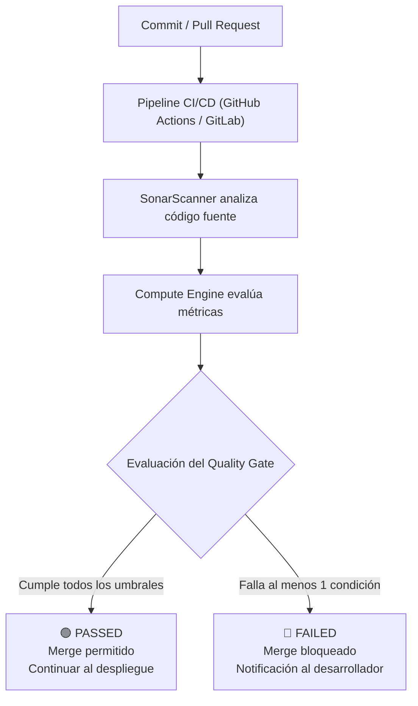
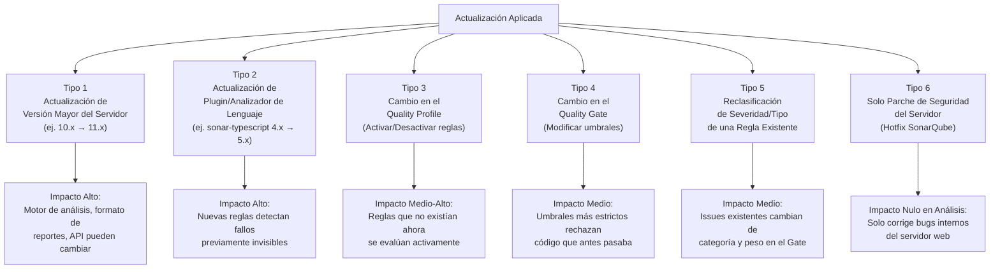
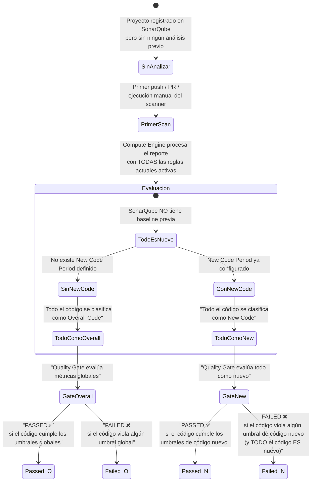
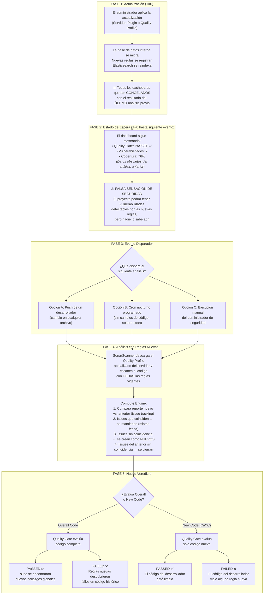

# Gobernanza con SonarQube: Quality Gates, Clean as You Code y Ciclo de Vida de Actualizaciones

> **Contexto:** Guía técnica avanzada sobre la gobernanza y operación continua de SonarQube. Explica a fondo la filosofía *Clean as You Code* (CaYC), el funcionamiento de las compuertas de calidad (*Quality Gates*), el impacto técnico de actualizar el servidor o plugins de reglas, y cómo se gestionan los cambios de estado (*PASSED* a *FAILED*).  
> **Ubicación:** `Seguridad_de_Sistemas/herramientas/SonarQube/`  
> **Documentos relacionados:**
> * [funcionamiento-sast-y-ejemplos.md](./funcionamiento-sast-y-ejemplos.md) (Motor interno, AST, Taint Analysis y ejemplos de código)
> * [sonarqube-cloud.md](./sonarqube-cloud.md) (Límites, cuotas y configuración en SonarQube Cloud)

---

## 1. Filosofía "Clean as You Code" (CaYC)

### 1.1. El problema del código heredado (*Legacy Code*)
Cuando una organización introduce SonarQube por primera vez en un proyecto con meses o años de antigüedad, el escáner inicial suele arrojar cifras alarmantes:

```
[ ANÁLISIS HISTÓRICO INICIAL ]
  ├── Líneas de código: 250.000
  ├── Vulnerabilidades acumuladas: 42
  ├── Bugs funcionales: 180
  ├── Code Smells: 3.400
  └── Deuda Técnica Total: ~6 meses de desarrollo continuo
```

Si el equipo de seguridad intenta aplicar una política de tolerancia cero sobre todo el historial del repositorio (*Overall Code*), ocurre lo que en la industria se conoce como **parálisis de entrega**:
1. El equipo de desarrollo se ve obligado a pausar los requerimientos del negocio para corregir código escrito hace años por personas que quizás ya ni están en la empresa.
2. Tocar código antiguo funcional solo para eliminar *code smells* introduce regresiones involuntarias.
3. Se genera rechazo cultural hacia las herramientas de seguridad (*DevSecOps*), culminando en la desactivación de las alertas.

---

### 1.2. La Regla de Oro: "Detener la Fuga" (*Stop the Leak*)
La filosofía **Clean as You Code** propone cambiar el foco: en lugar de resolver de golpe el pasado, se asegura el presente.

> **Principio Fundamental:**  
> *"No importa el estado del código histórico; lo que escribas hoy debe nacer limpio y seguro. Si no entra suciedad nueva al sistema, el código mejorará de forma natural con cada iteración."*

```
┌─────────────────────────────────────────────────────────────┬─────────────────────────────────────────────────────────────┐
│                 CÓDIGO HISTÓRICO (Overall)                  │                  CÓDIGO NUEVO (New Code)                    │
├─────────────────────────────────────────────────────────────┼─────────────────────────────────────────────────────────────┤
│ • Miles de líneas heredadas sin tocar.                      │ • Líneas añadidas o modificadas en el commit/PR actual.     │
│ • Acumula la deuda técnica pasada.                          │ • Evaluado de forma estricta e implacable.                  │
│ • No bloquea el trabajo diario del desarrollador.           │ • Si contiene vulnerabilidades, BLOQUEA el despliegue.      │
│ • Se va saneando de forma progresiva al refactorizar.       │ • Garantiza que el sistema nunca empeore su seguridad.      │
└─────────────────────────────────────────────────────────────┴─────────────────────────────────────────────────────────────┘
```

---

### 1.3. ¿Cómo define SonarQube qué es "Código Nuevo"? (*New Code Period*)
SonarQube utiliza el motor de Git (`git blame` y árboles de diferencias o *diffs*) para identificar con exactitud qué líneas pertenecen al ciclo de trabajo actual. 

Existen tres formas estándar de definir el periodo de código nuevo:

1. **Previous Version (Recomendada para ramas principales):**
   * Cualquier cambio realizado desde el último tag de release (por ejemplo, desde la versión `v2.1.0`).
   * Al publicar una nueva versión (`v2.2.0`), el contador de código nuevo se reinicia y todo lo anterior pasa a considerarse histórico.
2. **Reference Branch (Recomendada para Pull Requests):**
   * El código nuevo es exactamente el *diff* entre la rama del desarrollador (ej. `feature/modulo-denuncias`) y la rama objetivo (ej. `main`).
3. **Number of Days (ej. 30 días):**
   * Considera nuevo cualquier código escrito en los últimos $N$ días (útil para proyectos con entregas continuas sin versionado semántico formal).

---

## 2. Quality Gate: El Guardián Automatizado en CI/CD

El **Quality Gate** es la barrera booleana (verdadero o falso) que traduce las métricas del análisis en una decisión de negocio: **¿Este código está listo para producción?**



---

### 2.1. Métricas y Umbrales Estándar Recomendados

Para aplicar *Clean as You Code* de forma rigurosa en ciberseguridad, el Quality Gate estándar (*Sonar way*) enfoca sus condiciones en el **Código Nuevo**:

| Métrica Evaluada | Condición Exigida | Justificación Técnica de Seguridad |
|---|---|---|
| **Nuevas Vulnerabilidades** | **= 0** | Tolerancia cero a brechas explotables directas (SQLi, XSS, etc.). |
| **Nuevos Bugs Críticos/Bloqueantes** | **= 0** | Evita caídas del servicio o comportamientos anómalos en producción. |
| **Security Hotspots Revisados** | **= 100%** | Todo código sensible (criptografía, permisos, tokens) debe contar con visto bueno humano. |
| **Cobertura en Código Nuevo** | **$\ge 80\%$** | Asegura que la lógica nueva cuente con pruebas unitarias e integrales. |
| **Duplicación de Código Nuevo** | **$\le 3\%$** | Evita la dispersión de errores por copia y pega masivo. |
| **Security Rating en Código Nuevo** | **= A** | Garantiza la máxima calificación de seguridad posible en cada entrega. |

---

### 2.2. Integración y Bloqueo en Pull Requests (*PR Decoration*)
Cuando el Quality Gate está conectado a GitHub, GitLab o Bitbucket:
* **Comenta directamente en la línea infractora:** El desarrollador ve el problema directamente en la interfaz del PR sin necesidad de entrar a la consola de SonarQube.
* **Bloquea el botón de Merge:** La protección de ramas (*Branch Protection Rule*) impide fusionar la rama si el check `sonarqube/qualitygate` está en rojo.

---

## 3. Ciclo de Vida Completo: ¿Qué Ocurre al Actualizar SonarQube o sus Plugins?

Una duda crítica en la administración de plataformas DevSecOps es:  
*¿Si actualizo la versión del servidor o los plugins de analizadores de lenguajes, los proyectos ya analizados se actualizan solos o esperan al siguiente push? ¿Puede un proyecto pasar de PASS a FAIL sin que nadie haya modificado el código?*

---

### 3.1. Principio Fundamental: Los Proyectos NO se Reanalizan Automáticamente

Cuando se actualiza el servidor de SonarQube o se instala una nueva versión del plugin de TypeScript/JavaScript:
* **El servidor almacena resultados consolidados, no el código fuente.** En la base de datos reside un conjunto de métricas numéricas (cantidad de vulnerabilidades, duplicaciones, cobertura) y una lista de incidencias (*issues*) con sus coordenadas (archivo, línea, regla). Pero **no** reside el código fuente completo ni el AST parseado. El procesamiento sintáctico del AST, la ejecución de analizadores y la recopilación de cobertura dependen del **SonarScanner**, el cual corre en el entorno del cliente o runner de CI/CD.
* **Las métricas y pantallas quedan congeladas:** El dashboard seguirá mostrando el estado del último análisis registrado en la base de datos hasta que se dispare una nueva ejecución del escáner.

> [!NOTE]
> **Excepción de metadatos:** Si una regla existente solo cambia su texto descriptivo, referencias a normativas (CWE/OWASP) o etiquetas informativas en la base de datos, SonarQube reindexa Elasticsearch y la información textual se actualiza en pantalla. Sin embargo, **ninguna vulnerabilidad nueva será descubierta en el código hasta que el escáner se ejecute nuevamente**.

---

### 3.2. Taxonomía Completa de los Tipos de Actualización y su Impacto

No todas las actualizaciones son iguales. El impacto sobre los proyectos existentes varía drásticamente según **qué** se actualizó:



A continuación se detalla cada tipo con profundidad:

---

#### Tipo 1: Actualización de Versión Mayor del Servidor (ej. SonarQube 10.x → 11.x)

**¿Qué cambia internamente?**
* El motor central del Compute Engine (CE) se reescribe o mejora.
* Pueden añadirse nuevas categorías de análisis completas (ej. análisis de *Infrastructure as Code* en Terraform o Dockerfile).
* Puede cambiar el formato interno del reporte `.zip` que genera el escáner, obligando a actualizar también el `SonarScanner` en CI/CD.
* Se pueden deprecar o eliminar reglas antiguas y sustituirlas por reglas nuevas con lógica mejorada.

**Estado de los proyectos existentes:**

| Momento | Estado del Dashboard | Quality Gate | Datos en Base de Datos |
|---|---|---|---|
| **Inmediatamente tras la actualización** | Sigue mostrando los resultados del último análisis previo. Sin cambios visibles. | Mantiene el último veredicto (`PASSED` o `FAILED`) registrado. | Las incidencias antiguas persisten tal cual; no se borran ni se recalculan. |
| **Primer análisis post-actualización** | Se regeneran todas las métricas con el motor nuevo. Pueden aparecer incidencias nuevas en código histórico que antes eran invisibles. | Se recalcula con las métricas nuevas. **Puede cambiar de estado.** | Las incidencias antiguas se comparan con las nuevas mediante un algoritmo de *tracking*. |

**Ejemplo concreto:**
```
ANTES (SonarQube 10.8)
  Proyecto: modulo_policia_backend
  Vulnerabilidades: 2 (Known)
  Quality Gate: PASSED (ambas están en código histórico, CaYC no las cuenta)

ACTUALIZACIÓN → SonarQube 11.2

PRIMER PUSH (Un dev cambia un README.md)
  SonarScanner corre con el nuevo motor de análisis
  
  Motor nuevo detecta:
    ├── Las 2 vulnerabilidades anteriores siguen ahí (se re-reconocen por tracking)
    ├── 3 vulnerabilidades NUEVAS en código histórico (antes eran invisibles)
    │     ├── ReDoS en src/utils/validators.ts (regla S5852 mejorada)
    │     ├── Open Redirect en src/auth/callback.ts (regla nueva S5146)
    │     └── Insecure Cookie en src/middleware/session.ts (regla S2092 mejorada)
    └── 0 vulnerabilidades en código nuevo (el dev solo tocó el README)
  
  Quality Gate (CaYC):  PASSED ✅ (código nuevo limpio)
  Quality Gate (Global): FAILED ❌ (5 vulnerabilidades totales vs. umbral de 0)
  
  Deuda técnica global: Sube de 12h a 18h
```

---

#### Tipo 2: Actualización de Plugin/Analizador de Lenguaje (ej. sonar-javascript 11.x → 12.x)

**¿Qué cambia internamente?**
* El parser del lenguaje se actualiza (puede interpretar sintaxis nueva del lenguaje, como nuevas APIs de ECMAScript 2026).
* Se incorporan nuevas reglas de detección que antes no existían.
* Las reglas existentes mejoran su **profundidad de análisis** — por ejemplo, el *Taint Analysis* puede rastrear el flujo de datos a través de más funciones o módulos.
* **Importante:** Las reglas nuevas que vienen con el plugin pueden o no activarse automáticamente, dependiendo de la configuración del **Quality Profile**.

**¿Las reglas nuevas se activan solas?**

| Configuración del Quality Profile | ¿Se activan las reglas nuevas del plugin? |
|---|---|
| **Quality Profile heredado de "Sonar way" (Built-in)** | **SÍ, automáticamente.** El perfil *Sonar way* lo mantiene SonarSource y al actualizar el plugin, las reglas que ellos consideren estándar se activan solas. |
| **Quality Profile personalizado (Custom)** | **NO.** Las reglas nuevas se instalan desactivadas. El administrador debe ir a `Quality Profiles → Activate More Rules` y activarlas manualmente o heredar del *Sonar way* actualizado. |

**Ejemplo concreto — Plugin de TypeScript actualizado:**
```
ANTES (sonar-typescript v4.2)
  Reglas activas en el Quality Profile: 285
  El plugin NO tiene regla para detectar "Prototype Pollution"
  
  Proyecto: modulo_policia_backend
  Vulnerabilidades detectadas: 0
  Quality Gate: PASSED ✅

ACTUALIZACIÓN DEL PLUGIN → sonar-typescript v5.0
  Reglas disponibles: 320 (+35 nuevas)
  
  Si el perfil es "Sonar way" (Built-in):
    └── 30 de las 35 reglas nuevas se activan automáticamente
         └── Entre ellas: typescript:S6918 "Prototype Pollution detection"
  
  Si el perfil es personalizado (Custom):
    └── Las 35 reglas quedan desactivadas hasta que el admin las active

SIGUIENTE PUSH (Desarrollador modifica auth.controller.ts)
  SonarScanner aplica las 30 reglas nuevas al código completo
  
  Descubre en src/utils/merge.ts (código de hace 2 años):
    function deepMerge(target: any, source: any) {
      for (const key in source) {
        // ❌ Prototype Pollution: no valida "__proto__" ni "constructor"
        target[key] = source[key];
      }
    }
  
  RESULTADO:
    Vulnerabilidad nueva registrada en código HISTÓRICO
    
    Quality Gate (CaYC): PASSED ✅ 
      → El dev no tocó merge.ts; su código nuevo está limpio
    
    Dashboard global: 1 vulnerabilidad nueva visible
      → Aparece como "Overall Code" issue
      → La deuda técnica global sube
```

---

#### Tipo 3: Cambio en el Quality Profile (Activar/Desactivar Reglas Manualmente)

**¿Qué cambia internamente?**
El administrador de SonarQube decide activar reglas que estaban desactivadas o desactivar reglas que considera irrelevantes para el proyecto. Esto **no** requiere actualizar ni el servidor ni el plugin — es un cambio de configuración pura en la base de datos.

**Impacto:**

| Acción del Administrador | Efecto en el Siguiente Análisis |
|---|---|
| **Activar una regla previamente desactivada** | Todo el código (histórico y nuevo) se evalúa contra la regla. Pueden aparecer decenas de incidencias nuevas de golpe en código viejo. |
| **Desactivar una regla activa** | Todas las incidencias abiertas de esa regla se cierran automáticamente con resolución `REMOVED` en el siguiente análisis. El contador de vulnerabilidades baja. |
| **Cambiar los parámetros de una regla** (ej. longitud mínima de contraseña de 8 a 12) | Las incidencias previas se recalculan. Código que antes era "suficiente" con 8 caracteres ahora falla con el umbral de 12. |

**Ejemplo concreto — Activar regla de complejidad ciclomática:**
```
ADMINISTRADOR ACTIVA: typescript:S3776 
  "Cognitive Complexity should not be too high"
  Umbral configurado: máximo 15 puntos de complejidad por función

ESTADO PREVIO:
  La regla estaba desactivada → 0 incidencias registradas

SIGUIENTE ANÁLISIS:
  El escáner evalúa todas las funciones del proyecto contra la regla
  
  Encuentra 23 funciones que superan complejidad 15:
    src/services/denuncias.service.ts   → procesarDenuncia()       → Complejidad: 42
    src/services/patrullaje.service.ts  → calcularRutaOptima()     → Complejidad: 38
    src/controllers/auth.controller.ts  → loginMultiFactor()       → Complejidad: 27
    ... (20 funciones más)
  
  RESULTADO:
    23 Code Smells nuevos aparecen de golpe en el dashboard
    
    Si la regla fue categorizada como "Bug" o "Vulnerability"
    en lugar de "Code Smell":
      → Podría romper el Quality Gate
    
    Si es Code Smell (lo habitual):
      → El Quality Gate NO se rompe (el gate estándar
         no cuenta code smells), pero la deuda técnica
         sube considerablemente
```

---

#### Tipo 4: Cambio en el Quality Gate (Modificar Umbrales o Agregar Condiciones)

**¿Qué cambia internamente?**
No cambian las reglas ni el motor de análisis. Lo que cambia son los **criterios de aprobación/rechazo** que el Compute Engine aplica sobre las métricas ya calculadas.

> [!IMPORTANT]
> Este es el único tipo de cambio donde el **resultado del Quality Gate puede cambiar sin necesidad de un nuevo análisis** si SonarQube recalcula el veredicto del gate contra las métricas almacenadas del último escaneo. En la práctica, la mayoría de las implementaciones recalculan el gate en el siguiente análisis, pero en SonarQube Cloud el estado puede actualizarse casi inmediatamente en el dashboard.

**Ejemplo concreto — Añadir condición de cobertura:**
```
QUALITY GATE ANTES:
  Condiciones sobre código nuevo:
    ├── Vulnerabilidades nuevas = 0
    └── Bugs nuevos = 0
  
  Proyecto: modulo_policia_backend
  Cobertura en código nuevo: 45%
  Quality Gate: PASSED ✅ (no se evaluaba cobertura)

ADMINISTRADOR MODIFICA EL QUALITY GATE:
  Añade nueva condición:
    └── Cobertura en código nuevo ≥ 80%

SIGUIENTE ANÁLISIS (Push del Desarrollador C):
  El dev sube código nuevo con cobertura del 50%
  
  Evaluación del Quality Gate:
    ├── Vulnerabilidades nuevas: 0      ✅ (cumple)
    ├── Bugs nuevos: 0                  ✅ (cumple)
    └── Cobertura código nuevo: 50%     ❌ (no cumple el nuevo umbral de 80%)
  
  RESULTADO: FAILED ❌
  
  El desarrollador está confundido:
    "Ayer subí código con 45% de cobertura y pasó sin problemas,
     hoy subo con 50% y me lo rechaza..."
  
  CAUSA: El administrador endureció los umbrales del Quality Gate
```

---

#### Tipo 5: Reclasificación de Severidad o Tipo de una Regla Existente

**¿Qué cambia internamente?**
La regla sigue existiendo y detectando lo mismo, pero se cambia su **categoría** (de Code Smell a Vulnerability) o su **severidad** (de Minor a Critical/Blocker). Este cambio puede ser realizado por:
* **SonarSource** (el fabricante), al actualizar el plugin con una nueva clasificación basada en CVEs recientes.
* **El administrador**, manualmente desde el Quality Profile.

**Ejemplo concreto — `console.log` pasa de Code Smell a Vulnerability:**
```
REGLA: typescript:S106 "Standard outputs should not be used directly"

ANTES DE LA RECLASIFICACIÓN:
  Tipo: Code Smell (Maintainability)
  Severidad: Minor
  
  El proyecto tiene 47 archivos con console.log
  → 47 Code Smells Minor registrados
  → No afectan el Quality Gate (el gate estándar no evalúa code smells)
  → Quality Gate: PASSED ✅

EL EQUIPO DE SEGURIDAD RECLASIFICA LA REGLA:
  Justificación: "En producción, console.log puede filtrar datos
  personales (PII), tokens de sesión y trazas de error con rutas
  del servidor al navegador del usuario"
  
  Nuevo Tipo: Vulnerability (Security)
  Nueva Severidad: Major

SIGUIENTE ANÁLISIS:
  Las mismas 47 líneas de código son re-evaluadas
  
  Antes: 47 Code Smells Minor  → No contaban para el gate
  Ahora: 47 Vulnerabilidades Major → SÍ cuentan para el gate
  
  Evaluación del Quality Gate (si evalúa Overall Code):
    └── Vulnerabilidades totales: 47   ❌ (umbral era 0)
  
  RESULTADO: FAILED ❌
  
  Evaluación del Quality Gate (CaYC - solo New Code):
    └── Vulnerabilidades en código nuevo: 0  ✅
        (los console.log están en código histórico)
  
  RESULTADO: PASSED ✅ para el PR del desarrollador
             Pero 47 nuevas vulnerabilidades visibles en el dashboard global
```

---

#### Tipo 6: Parche de Seguridad del Servidor (Hotfix de SonarQube)

**¿Qué cambia internamente?**
Estos parches corrigen vulnerabilidades del propio servidor web de SonarQube (ej. una vulnerabilidad XSS en la interfaz administrativa, un fallo de autenticación en la API REST, o un problema de permisos en el acceso a proyectos privados).

**Impacto en los proyectos analizados:**

| Aspecto | Impacto |
|---|---|
| Reglas de análisis | **Ninguno.** No cambian las reglas ni los analizadores. |
| Métricas almacenadas | **Ninguno.** Los datos en la base de datos permanecen intactos. |
| Quality Gate | **Ninguno.** El veredicto no cambia. |
| Siguiente análisis | Producirá exactamente los mismos resultados que antes del parche. |

---

### 3.3. Matriz Consolidada: Estado de los Proyectos Según el Tipo de Actualización

La siguiente tabla resume de forma compacta el efecto inmediato y posterior de cada tipo de actualización sobre un proyecto analizado que estaba en estado `PASSED`:

| Tipo de Actualización | ¿Cambia algo inmediatamente en el dashboard? | ¿Qué pasa en el siguiente análisis? | ¿Puede pasar a FAILED? | ¿Dónde aparecen los nuevos hallazgos? |
|---|---|---|---|---|
| **T1: Versión mayor del servidor** | No. Dashboard congelado. | Motor nuevo re-evalúa todo el código. Posibles hallazgos masivos en código histórico. | **SÍ** (Overall) / Improbable (CaYC) | Overall Code |
| **T2: Plugin/analizador de lenguaje** | No. Dashboard congelado. | Reglas nuevas detectan patrones invisibles antes. Reglas mejoradas tienen mayor profundidad de taint analysis. | **SÍ** (Overall) / Improbable (CaYC) | Overall Code |
| **T3: Activar regla en Quality Profile** | No. Dashboard congelado. | Todo el código se escanea contra la regla recién activada. | **SÍ** (si la regla es de tipo Vulnerability/Bug) | Overall Code |
| **T4: Endurecer umbrales del Quality Gate** | Puede recalcularse en el dashboard (dependiendo de la implementación). | Métricas existentes se comparan contra umbrales más estrictos. | **SÍ** (incluso sin nuevos hallazgos, si una métrica como cobertura no alcanza el nuevo umbral) | N/A (no hay nuevos hallazgos; el código no cambió) |
| **T5: Reclasificar severidad/tipo de regla** | No directamente en el gate. Los issues existentes cambian de ícono/categoría en la UI. | Issues existentes se contabilizan en la nueva categoría. Code Smells que ahora son Vulnerabilities suman al contador de seguridad. | **SÍ** (Overall) / Improbable (CaYC) | Overall Code (issues ya existentes cambian de categoría) |
| **T6: Hotfix de seguridad del servidor** | No. | Resultados idénticos al análisis previo. | **NO** | N/A |

---

### 3.4. Estado de los Proyectos Nuevos que Están Subiendo por Primera Vez

Un proyecto que **nunca ha sido analizado** por SonarQube y se configura por primera vez **después** de una actualización reciente tiene un comportamiento distinto al de los proyectos ya existentes:



> [!WARNING]
> **Trampa del primer análisis con CaYC:** Si el *New Code Period* está configurado como `Previous Version` y el proyecto no tiene ningún tag de versión en Git, SonarQube podría considerar **todo** el código como "nuevo". Esto significa que los 250.000 líneas de código heredado se evalúan con la misma rigurosidad que el código de hoy. En ese caso, un proyecto nuevo puede entrar directamente a **FAILED** en su primer análisis, evaluado con todas las reglas actualizadas del servidor.

**Ejemplo detallado — Proyecto nuevo registrado después de actualizar el plugin de TypeScript:**

```
CONTEXTO:
  SonarQube fue actualizado ayer con sonar-typescript v5.0
  Se activan 30 reglas nuevas de seguridad automáticamente (Quality Profile: Sonar way)
  
  Hoy se registra un proyecto nuevo: "sistema_emergencias_backend"
  El código tiene 18 meses de desarrollo sin ningún análisis previo
  15.000 líneas de TypeScript

PRIMER ANÁLISIS:
  SonarScanner procesa las 15.000 líneas con las 320 reglas activas
  (incluidas las 30 reglas nuevas del plugin actualizado)
  
  Hallazgos:
    ├── 8 Vulnerabilidades
    │     ├── 3 SQL Injection (detectadas por reglas que existían antes)
    │     ├── 2 Prototype Pollution (detectadas por regla NUEVA del plugin v5.0)
    │     ├── 2 Hardcoded Secrets
    │     └── 1 Open Redirect (detectada por regla NUEVA del plugin v5.0)
    ├── 12 Bugs
    ├── 340 Code Smells
    └── 5 Security Hotspots sin revisar

  New Code Period = "Previous Version"
  
  CASO A: El proyecto tiene un tag v1.0.0 de hace 6 meses
    → Código nuevo = cambios desde v1.0.0 = ~4.000 líneas
    → De las 8 vulnerabilidades, 2 están en código nuevo
    → Quality Gate (CaYC): FAILED ❌ (2 vulnerabilidades nuevas)
    → Las otras 6 aparecen como deuda técnica global (no rompen el gate)
    
  CASO B: El proyecto NO tiene ningún tag de versión
    → SonarQube no puede calcular qué es "nuevo"
    → Comportamiento por defecto: TODO se considera código nuevo
    → Quality Gate (CaYC): FAILED ❌ (8 vulnerabilidades en "código nuevo")
    → El equipo necesita crear un tag (git tag v0.1.0) y re-analizar
       para establecer la baseline
```

---

### 3.5. Línea de Tiempo Completa: Del Instante de la Actualización al Impacto Real



---

### 3.6. Escenarios Exhaustivos de Transición de Estado

#### Escenario 1: Proyecto Estable + Actualización de Plugin + Push Trivial

Un proyecto lleva 6 meses en producción con estado `PASSED`. Un desarrollador sube un cambio insignificante (actualizar un comentario o un archivo `.md`).

```typescript
// ============================================================
// ARCHIVO: src/utils/validators.ts (código de hace 2 años)
// Antes de la actualización: SonarQube NO detectaba este patrón
// Después de la actualización: Regla S5852 (ReDoS) lo detecta
// ============================================================
export function esEmailValido(email: string): boolean {
  // ❌ Expresión regular con backtracking catastrófico
  // Un atacante envía "aaaaaaaaaaaaaaaaaaaaaaaaaaa!" y el servidor se congela
  const emailRegex = /^([a-zA-Z0-9_\.\-])+\@(([a-zA-Z0-9\-])+\.)+([a-zA-Z0-9]{2,4})+$/;
  return emailRegex.test(email);
}
```

**Resultado:**
* **Con Quality Gate CaYC (solo código nuevo):** El desarrollador no tocó `validators.ts` → Su PR sale **PASSED ✅**. Pero en el dashboard global aparece 1 nueva vulnerabilidad de tipo ReDoS en Overall Code.
* **Con Quality Gate Overall:** El pipeline falla con **FAILED ❌** por una vulnerabilidad que el desarrollador no escribió, no modificó y que existía desde hace 2 años.

---

#### Escenario 2: Administrador Activa Regla Desactivada + Escaneo Nocturno

```
LÍNEA DE TIEMPO:

  Lunes 14:00 — Administrador activa la regla typescript:S4502
                "Permissions of the CORS policy should be reviewed"
                en el Quality Profile del proyecto
                
  Lunes 14:01 — Dashboard: Sin cambios visibles. 
                Quality Gate sigue en PASSED ✅
                (La regla está activada pero ningún escáner ha corrido)
                
  Lunes 23:00 — Ningún desarrollador ha hecho push en todo el día
  
  Martes 02:00 — Cron nocturno ejecuta SonarScanner en la rama main
                 
                 El escáner descarga el Quality Profile actualizado
                 Detecta en 4 archivos la cabecera CORS con origen "*":
                 
                   src/main.ts:15           → app.enableCors({ origin: '*' })
                   src/gateway/ws.ts:8      → cors: { origin: '*' }
                   src/middleware/cors.ts:3  → Access-Control-Allow-Origin: *
                   test/e2e/setup.ts:12     → cors: { origin: '*' }
                 
                 Registra 3 Security Hotspots (los de src/) 
                 y 0 en test/ (excluido por sonar.exclusions)
                 
  Martes 02:02 — Compute Engine evalúa el Quality Gate:
                 Security Hotspots sin revisar: 3 de 3 = 0% revisados
                 Condición del gate: "Security Hotspots revisados = 100%"
                 
                 Quality Gate: FAILED ❌
                 
  Martes 07:30 — El equipo de desarrollo llega a la oficina
                 Notificación en Slack/email: "main branch is now FAILING"
                 
                 NADIE TOCÓ EL CÓDIGO. La causa fue la activación de la
                 regla + el cron nocturno.
```

---

#### Escenario 3: Cambio en el Quality Gate + PR del Desarrollador

```typescript
// ============================================================
// PULL REQUEST #142: Desarrollador agrega endpoint de reportes
// ============================================================

// src/controllers/reportes.controller.ts (CÓDIGO NUEVO)
export class ReportesController {
  // Función con cobertura de tests: 60% (solo happy path)
  async generarReporte(filtros: FiltrosReporte): Promise<Buffer> {
    const datos = await this.service.obtenerDatos(filtros);
    // ❌ Falta test para filtros vacíos
    // ❌ Falta test para datos nulos
    // ❌ Falta test para filtros con inyección
    const pdf = await this.pdfService.renderizar(datos);
    return pdf;
  }
}
```

```
ANTES DEL CAMBIO DE QUALITY GATE:
  Condición de cobertura: ≥ 60%
  Cobertura del PR: 60%
  Quality Gate: PASSED ✅

EL ADMINISTRADOR CAMBIA EL UMBRAL:
  Nueva condición de cobertura: ≥ 80%
  (Motivación: "60% es insuficiente para código de seguridad pública")

EL DESARROLLADOR RE-PUSHEA (force push o nuevo commit):
  SonarScanner recalcula con los nuevos umbrales
  Cobertura del PR: 60%   →  ❌ No cumple ≥ 80%
  
  Quality Gate: FAILED ❌
  
  Mensaje en el PR de GitHub:
    "SonarQube Quality Gate failed
     ❌ Coverage on New Code: 60.0% (required ≥ 80.0%)
     ✅ Vulnerabilities on New Code: 0
     ✅ Bugs on New Code: 0"
  
  El desarrollador debe agregar tests para los 3 escenarios faltantes
  antes de poder hacer merge.
```

---

#### Escenario 4: Reclasificación de Severidad (Code Smell → Vulnerability)

```typescript
// ============================================================
// ARCHIVO: src/services/notificaciones.service.ts
// Código existente desde hace 1 año
// ============================================================

export class NotificacionesService {
  async enviarAlerta(oficial: Oficial, mensaje: string) {
    // Línea 45: console.log existente desde hace 1 año
    console.log(`Enviando alerta a ${oficial.email}: ${mensaje}`);
    // ❌ En producción esto imprime emails y contenido de alertas
    //    policiales en los logs del servidor, accesibles por
    //    cualquier persona con acceso a CloudWatch/Kibana

    await this.mailer.send(oficial.email, mensaje);
  }
}
```

```
ANTES DE LA RECLASIFICACIÓN:
  Regla typescript:S106 "Standard outputs should not be used directly"
  Tipo: Code Smell (Maintainability)
  Severidad: Minor
  
  Proyecto tiene 32 archivos con console.log en producción
  → 32 Code Smells Minor
  → Quality Gate: No evalúa code smells → PASSED ✅

RECLASIFICACIÓN POR EL EQUIPO DE SEGURIDAD:
  Nuevo Tipo: Vulnerability (Security)
  Nueva Severidad: Major
  Justificación técnica:
    "Los console.log en producción constituyen CWE-532 
     (Insertion of Sensitive Information into Log File).
     En el contexto de un sistema policial, los logs pueden contener
     nombres de oficiales, números de placa, contenido de denuncias
     y datos de víctimas protegidos por ley."

SIGUIENTE ANÁLISIS:
  Los 32 issues cambian de categoría en la base de datos:
    ANTES: 32 Code Smells Minor  → No contaban para seguridad
    AHORA: 32 Vulnerabilities Major → Cuentan para el Security Rating
  
  Security Rating del proyecto:
    ANTES: A (0 vulnerabilidades)
    AHORA: E (32 vulnerabilidades)
  
  Quality Gate (Overall): FAILED ❌
  Quality Gate (CaYC):    PASSED ✅ para PRs que no toquen esos archivos
```

---

#### Escenario 5: Proyecto Nuevo Entrando por Primera Vez tras Actualización

```
CONTEXTO:
  La empresa tiene SonarQube actualizado a la última versión
  con sonar-typescript v5.0 (320 reglas activas)
  
  Se incorpora un nuevo microservicio: "api_geolocalizacion_patrullas"
  Desarrollado durante 4 meses sin ningún análisis de seguridad
  8.200 líneas de TypeScript
  Sin tags de versión en Git (nunca se hizo un release formal)

CONFIGURACIÓN:
  sonar-project.properties:
    sonar.projectKey=api_geolocalizacion_patrullas
    sonar.sources=src
    sonar.newCodePeriod=previous_version
    # ⚠️ PROBLEMA: No hay ningún tag de versión en Git

PRIMER ANÁLISIS:
  SonarScanner intenta calcular el New Code Period
  
  Busca el último tag de Git: NO ENCUENTRA NINGUNO
  
  Comportamiento por defecto:
    → Todo el código (8.200 líneas) se clasifica como CÓDIGO NUEVO
    → Se aplica la rigurosidad máxima del Quality Gate
  
  Hallazgos en las 8.200 líneas:
    ├── 5 Vulnerabilidades
    │     ├── 2 SQL Injection
    │     ├── 1 Path Traversal  
    │     ├── 1 Insecure Randomness
    │     └── 1 Hardcoded Secret (API key de Google Maps)
    ├── 8 Bugs
    ├── 180 Code Smells
    ├── 3 Security Hotspots
    └── Cobertura de tests: 22%
  
  Quality Gate (CaYC - pero TODO es "nuevo"):
    ├── Vulnerabilidades nuevas: 5    ❌ (umbral: 0)
    ├── Bugs nuevos: 8                ❌ (umbral: 0)
    ├── Hotspots revisados: 0%        ❌ (umbral: 100%)
    └── Cobertura código nuevo: 22%   ❌ (umbral: ≥ 80%)
  
  Quality Gate: FAILED ❌ (4 condiciones incumplidas)

SOLUCIÓN PARA ESTABLECER BASELINE:
  # El equipo crea un tag de referencia en el commit actual
  git tag v0.0.1
  git push origin v0.0.1
  
  # Se re-analiza: ahora SonarQube tiene una baseline
  # Todo el código actual pasa a ser "Overall Code"
  # Solo lo que se escriba DESPUÉS del tag será "New Code"
  
  # Próximo análisis:
  # Quality Gate (CaYC): PASSED ✅ (no hay código nuevo aún)
  # Dashboard global: 5 vulnerabilidades en Overall Code (visible pero no bloqueante)
```

---

## 4. Resumen Ejecutivo: Tabla de Decisiones para el Administrador

| Pregunta | Respuesta | Acción Recomendada |
|---|---|---|
| **¿Al actualizar SonarQube cambia algo al instante en los proyectos?** | **No.** Las métricas quedan congeladas con el resultado del último análisis previo a la actualización. | Programar un escaneo manual o nocturno inmediatamente después de la actualización para descubrir el impacto real. |
| **¿Cuándo se manifiestan los cambios?** | En el momento en que se ejecuta `SonarScanner` (por push, PR o ejecución programada). | Configurar un cron nocturno en `main` para que la rama principal no acumule "sorpresas ocultas" durante días o semanas. |
| **¿Puede romper el build sin que nadie haya cambiado código?** | **SÍ**, si el Quality Gate evalúa *Overall Code* o si se endurecieron umbrales/se activaron reglas nuevas. | Usar **Clean as You Code** en los PRs para proteger a los desarrolladores. Reservar la evaluación global para auditorías planificadas. |
| **¿Cómo evitar sorpresas en producción?** | 1. Probar las nuevas reglas en un entorno *staging* antes de aplicar en producción. 2. Revisar el *changelog* del plugin para entender qué reglas se añadieron. | Mantener un entorno de QA donde se apliquen primero las actualizaciones y se ejecute un escaneo de prueba antes de actualizar la instancia de producción. |
| **¿Qué pasa con un proyecto nuevo que entra por primera vez?** | Se analiza con **todas** las reglas vigentes. Si no tiene tag de versión, todo el código se trata como "nuevo" y el gate aplica la máxima rigurosidad. | Siempre crear un tag de versión inicial (`git tag v0.0.1`) antes del primer análisis para establecer la *baseline*. |
| **¿Puedo revertir el estado a PASSED rápidamente?** | Sí: desactivar la regla conflictiva en el Quality Profile, reducir el umbral del Quality Gate o marcar las incidencias como *Won't Fix* / *False Positive*. | Evaluar caso por caso: si es un falso positivo legítimo, marcarlo; si es deuda técnica real, planificar la corrección en un sprint dedicado. |
